# Comparison of two segmentation methods for Lakes Datasets
### Computer vision project on satellite image segmentation 
#### We provide PyTorch code for building and training models, and python code for image retrieval and local feature matching.

## I. Setting the task. Pipeline.

For the semantic segmentation problem are currently being used different techniques, 
both with complex architecture and with complex training policies. 
An example of a complex learning policy is the transfer learning. 

In the situation of transfer learning one has a pre-trained network that does not know nothing about the task we want to solve, 
but already has some preliminary knowledge. Most likely, because we have given this 
preliminary knowledge in the form of the weights of the trained network, it will learn a bit 
better in the end, i.e. it will find the dependencies a bit faster and perhaps a bit more correctly. 

In this project the following question was investigated: to what extent does a pre-trained model improve the solution of the segmentation problem? 
Of particular interest is the fact that articles on satellite imagery have mentioned several times that transfer 
learning is not easy and does not always make sense.
That is why we will fix the architecture of the neural network and we will fix the augmentations of the dataset. 
Essentialy we will vary only the learning policy. In particular, we will check almost extreme cases - 
the training sample does not consist of satellite images (ImageNet).

The first choise for a semantic segmentation problem is the convolutional neural network with a U-Net architecture. 
We will use its [TernausNet](https://github.com/ternaus/TernausNet) modification:

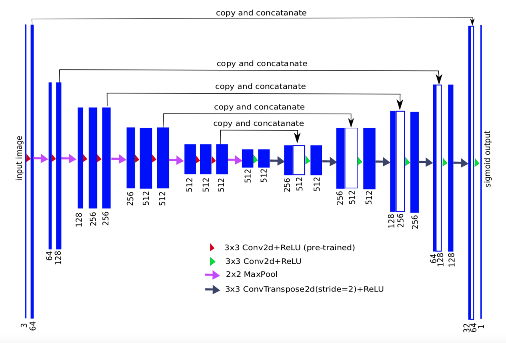

The U-Net has an interesting feature - 
if one looks at its encoder part, in the classic version the encoders architecture is exactly the same 
as that of the VGG neural network. 
The idea  
that was successfully implemented by Iglovikov in his [TernausNet](https://github.com/ternaus/TernausNet), 
is to train the entire network with a pre-trained VGG encoder. 
Important point of any problem of segmentation is that the labeling, or the creation of a pixel-wise mask for each object - 
in our current problem lake or, in general, water - on the image is a time-consuming and demanding task. VGG is a network 
that has been trained for a classification problem. For the latter it is much easier to assemble a large dataset. 
This is why we are in an interesting situation where we do the transfer learning not just between problems of the same formulation. 
For example, we have a network that was able to classify a thousand classes 
of ImageNet, but we want to distinguish just water from non-water, i.e. to solve a narrower classification 
problem. In this way, we use the classification problem as a basis for the segmentation task. 
We used VGG11 neural network pretrained on ImageNet. Remarkable is, that ImageNet is a dataset 
quite distinct from the lakes satellite image dataset)

## Dataset

The Dataset that we have is small. It consists of 212 satellite images of lakes and their high-quality masks
of a large size approximately 9000 by 9000 pixels. 
Nonetheless it would be hard to collect such on our own. In order to assemble it, 
we used the service of the [Yandex Toloka platform](https://toloka.yandex.ru/).
We set up an almost automatic pipeline of processing of the results. 

 - First one has to collect the raw images of lakes. 
For that aim one chooses a piece of land with a lake on it on 
[OpenStreetMap](https://www.openstreetmap.org). There one has to click the "Export" button in the left upper corner, then 
"Manually select a different area", then the "Overpass API" link. 
A file with the four values of the min/max longitude and latitude of the chosen rectangle will be downloaded. 

- Next one uses the 
[cloudless Sentinel-2 map of the world](https://s2maps.eu/), 
available for free, to retrieve the satellite image of the rectangle with the above downloaded coordinates. 
The corresponding collected dataset of raw satellite images of lakes is to be found 
[here](https://github.com/od-crypto/somedata/tree/master/img).

- These raw satellite images are then send to the developed Toloka pipeline for the creation of the pixel-wise 
labelling of water on the images with the means of crowdsourcing. 
To set the task 1) please run [the jupyter notebook](Toloka/Toloka_task.ipynb),
to create the Toloka task tsv-file, containing the raw lake image source urls, to be posted on the Yandex Toloka 
platform together with the 2) [description of the task](Toloka/Toloka_task_description.html); 3) adjust 
the specific settings on the Yandex Toloka platform.

 - Once one receives the Toloka answers for the pixel-wise labeling of water on the images in the form of json-strings,
to obtain the corresponding masks, one runs [the jupyter notebook](Toloka/Process_Toloka_json_results.ipynb).
It will take approximately half an hour, to obtain high-quality masks for the lake images as png-files. 
They will be saved in the folder datasets/sentinel/masks. If one wishes the images, the masks and their collages 
to be diplayed locally in running Jupyter Notebook, choose display_locally=True in the function create_masks, defined 
[here](Toloka/create_masks.py).
Below is an example of the satellite image of the Vyshnevolock Reservoir and its created mask:

Image             |  Mask  |  Collage
:-------------------------:|:-------------------------:|:-------------------------: 
  |  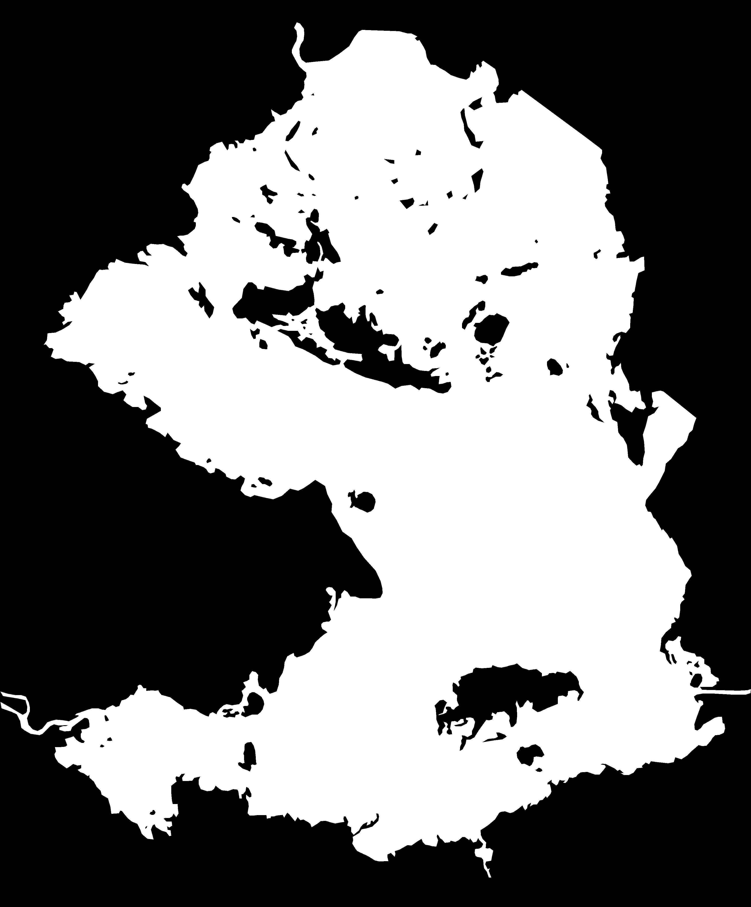  |  

(TODO: show the learning curve of Yandex Toloka). 
Thus with someone else's hands we segment the images, and now all we need is a little more money to 
get even larger datasets. 

## Augmentation of the Dataset: crops and rotations. 

Next, the task can be solved in different ways: one can, for example, 
resize every image we have to a certain size and try to get a clear mask with the 
network immediately. But we chose a different solution: each image and its mask 
was cropped into many rectangles, each having a characteristic size approximately such that a 
human being is still able to distinguish water from ground and forest on each crop. 
Having the crops and the correct segmentation masks for each crop accordingly, 
we fed them to the network to be trained and observed that the network was indeed able to learn. 
After that we covered the image with several layers with these 
crops, namely, we take the entire image on a square of 300 by 300 pixels, and then we 
shifted each square by another 150 pixels, i.e. we shifted the entire grid by a vector (150, 150). 
In total, it turns out that each point is covered by two squares. This makes it possible 
to increase the accuracy of the predictions, as the results coming from these squares 
are averaged. This is the test time augmentation (TTA) method. 

In this way, in the intermediate step we had 114440 crops with sizes from around 300 to around 500 pixels. 
We have to make sure that the network learns how to segment them. 
Since we have decided to use a pre-trained network, this imposes certain limitations. 
The input that we can consider must be exactly the input of the pre-trained network, 
i.e. the characteristic pre-processing to which the images were exposed when they entered ImageNet. 
This means that the input should be standardized to a fixed size 224 x 224 x 3 RGB image, 
and the normalisation should be fixed. This was done, plus custom augmentation was added. 
The most interesting part of an augmentation are the rotations.
So as to guarantee that there are no artifacts from the rotations, we made sure that the rotations were correct.
Namely we only implemented from scratch those rotations that are not to be found in the ready-to-use libraries, 
because the built-in rotations produce artifacts that can affect the learning. 
Since we have a unique situation where there is a huge image from which we cut crops, 
we decided to do the most honest crops possible. 
This is a very specific situation: it is a rare case where one can rotate honestly, 
preserving the characteristic size 
of the features and not adding any noise due to the artifacts of the rotation of the rectangle. 
In addition, since it is possible to analyse the statistics of the share of water on each crop, 
it turns out that there are too many crops with only land and no water. On the histogramm below 
on the y-axis are the number of crops and on the x-axis the shares of water, correspondingly (0-10. 10-20,...,90-100) %: 

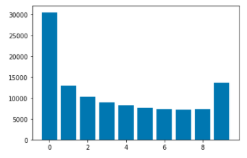

In order to make it easier for the network to learn, 
so that it does not fall into overfit, marking all pixels with either earth or water, we balanced the dataset. 
At that we have balanced the already rotated dataset, which guarantees that the training will be more 
correct. This diminished the augmented dataset to 86890 crops.

## II. Training the models for the segmentation problem. 

After we balance the dataset, we can start the training, which is the most interesting part.

There is a pre-trained classification model on ImageNet (vgg11), and there is an U-net segmentation network in which vgg11 can be built. 
We compared two variants - training from scratch and training with a pretrained VGG encoder:

- pure unet (ternausnet pretrained=False) 
- unet + pretrained vgg11 on ImageNet

And indeed, it turns out that training of the network with the pretrained on ImageNet VGG11 encoder 
yields a model which provides better segmentation results. One can compare the two models on an inference, while 
running the [the jupyter notebook](demo/demo.ipynb),

Inference Image             |  from scratch  |  pretrained
:-------------------------:|:-------------------------:|:-------------------------: 
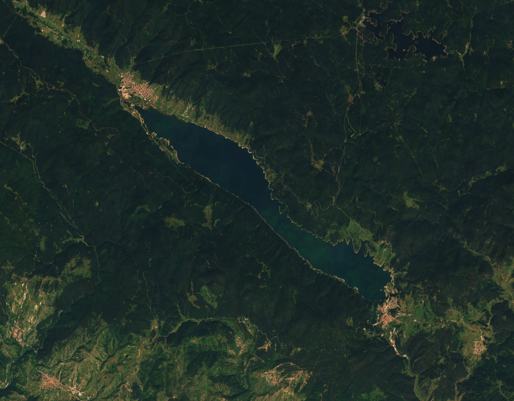  |  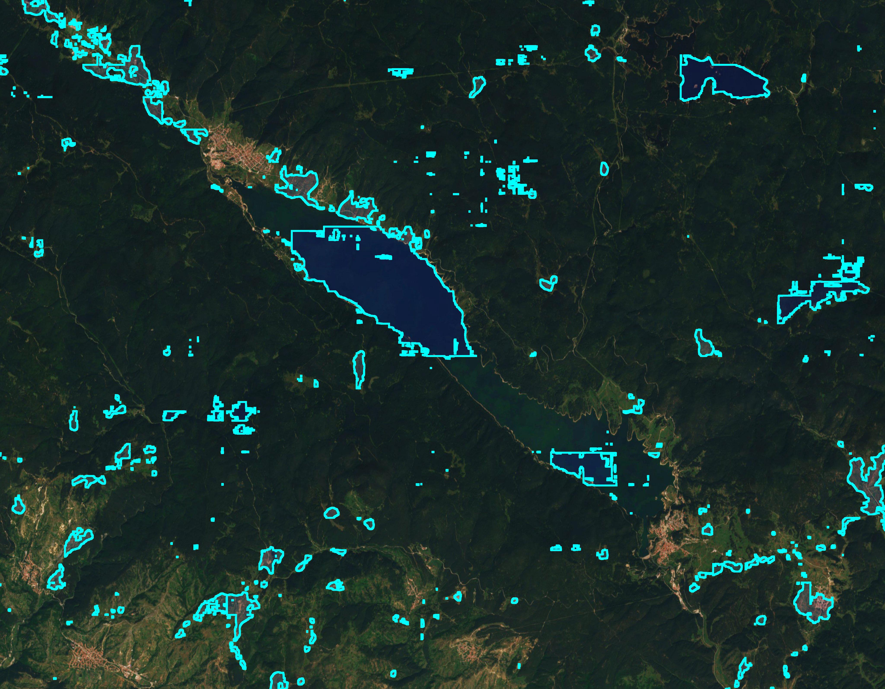  |  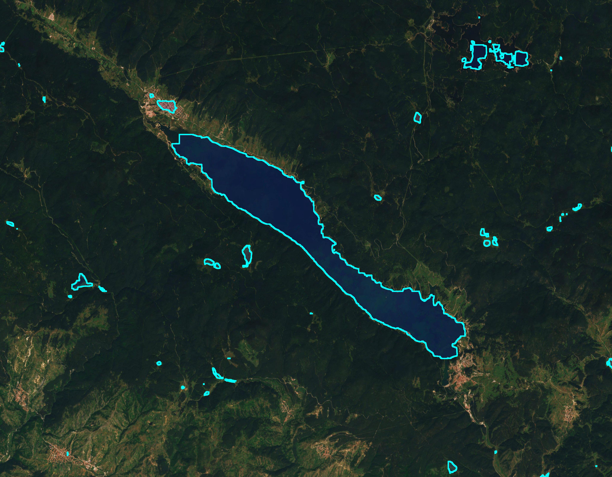

Inference Image             |  from scratch  |  pretrained
:-------------------------:|:-------------------------:|:-------------------------: 
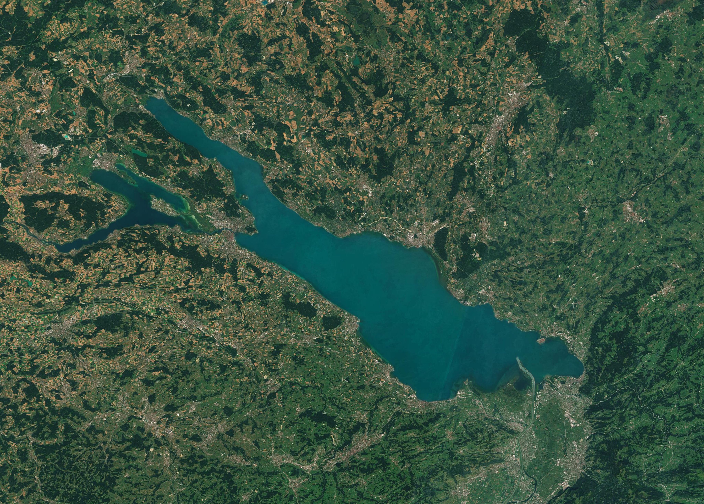  |  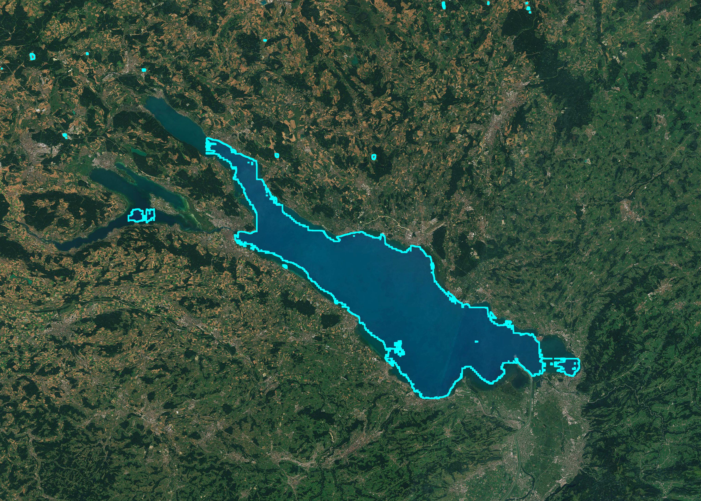  |  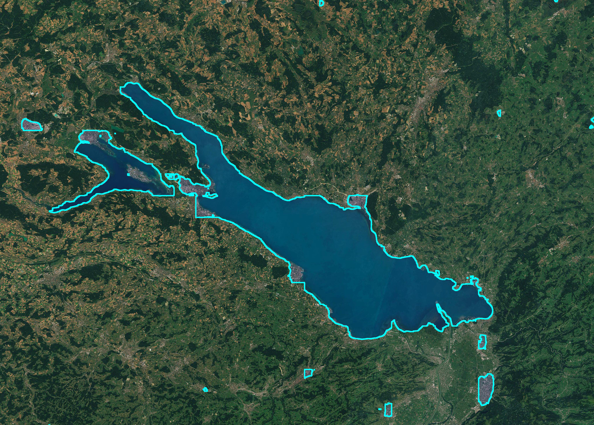

Inference Image             |  from scratch  |  pretrained
:-------------------------:|:-------------------------:|:-------------------------: 
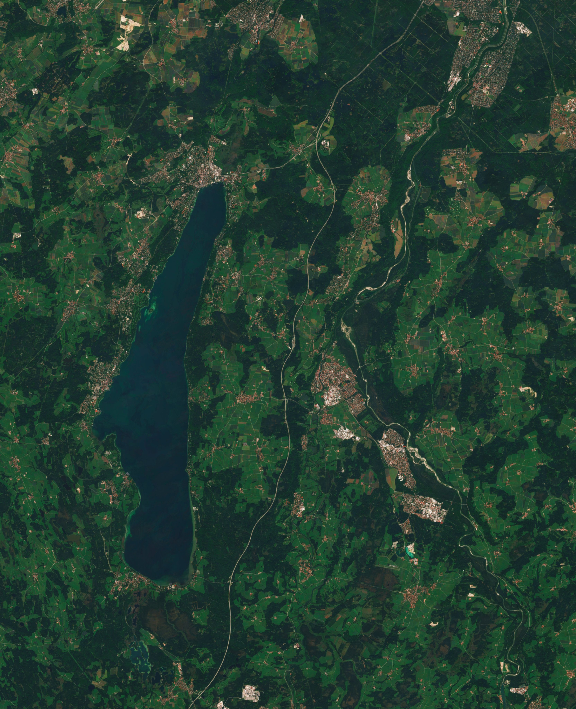  |  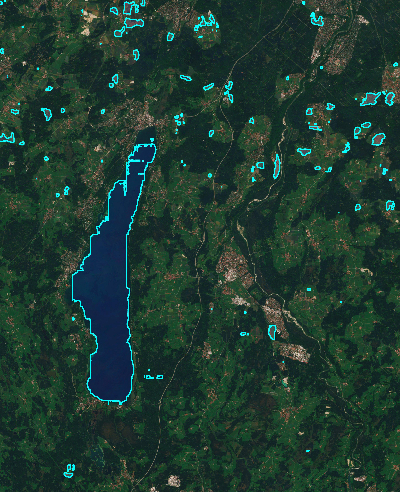  |  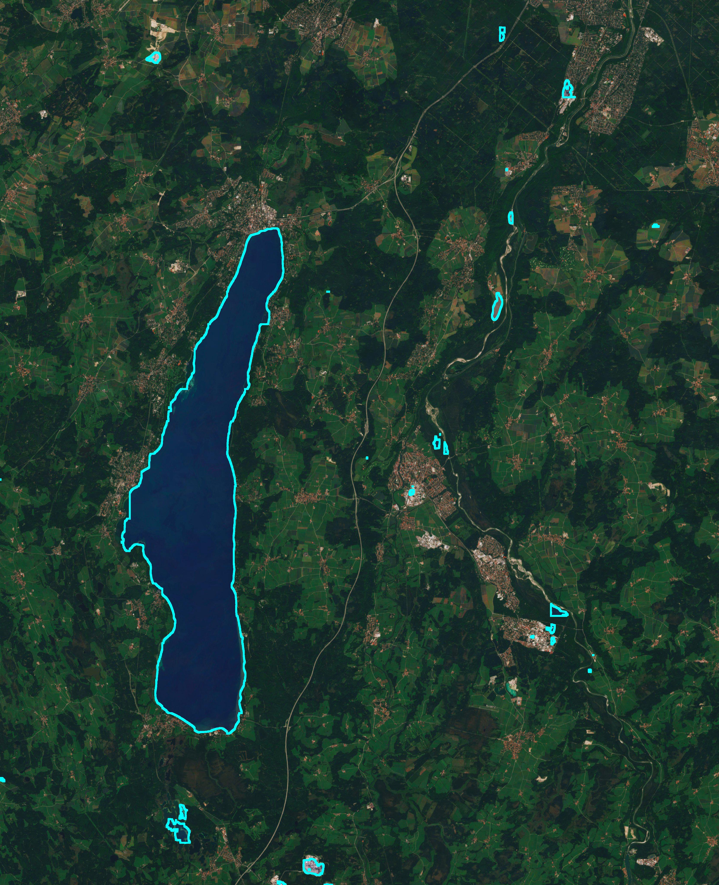

## III. Results. 
TODO: show Loss function graphs for the two models. Explain, that they show, that the pretrained on ImageNet encoder helps avoid overfitting.
TODO: Provide the final two numbers - the Mean Intersection over Union accuracy metrics (MIOU, or the so-called Dice Loss). 

Technical stack details: 1) everything was implemented from scratch for educational purposes, 
i.e. pytorch was used without frameworks, 
2) custom augmentaion was implemented manually, without usage of the built-in libraries, 3) training was carried out on a vast.ai
